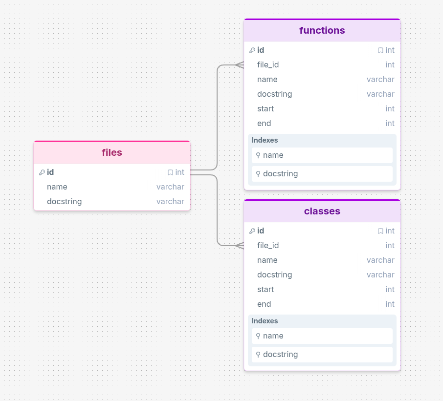
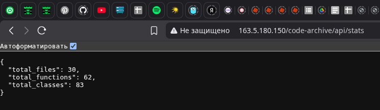
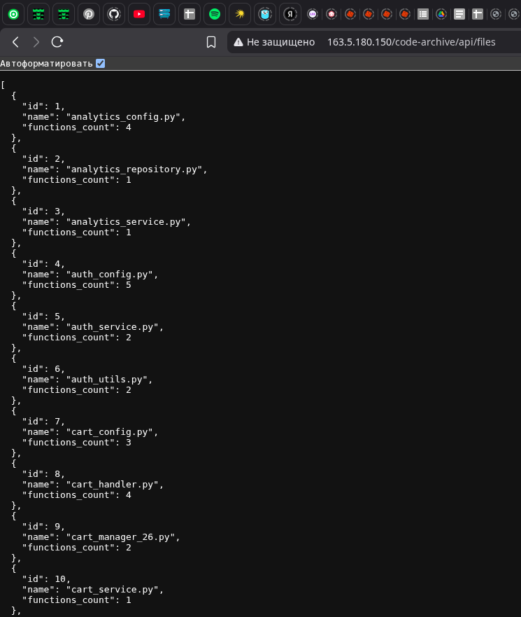
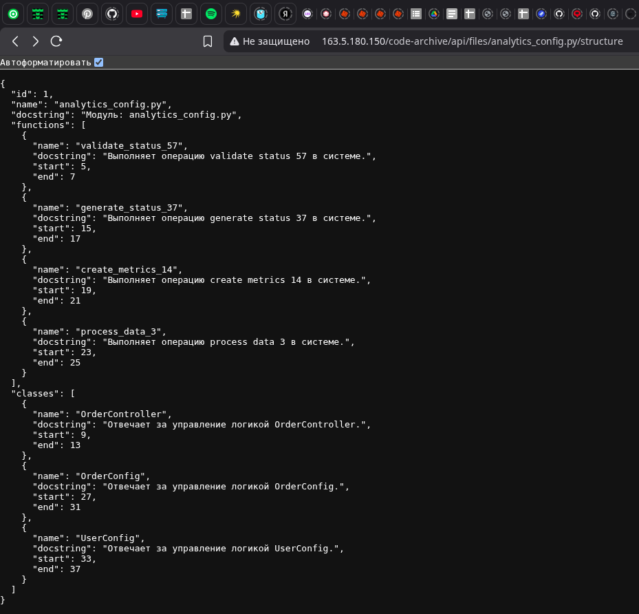
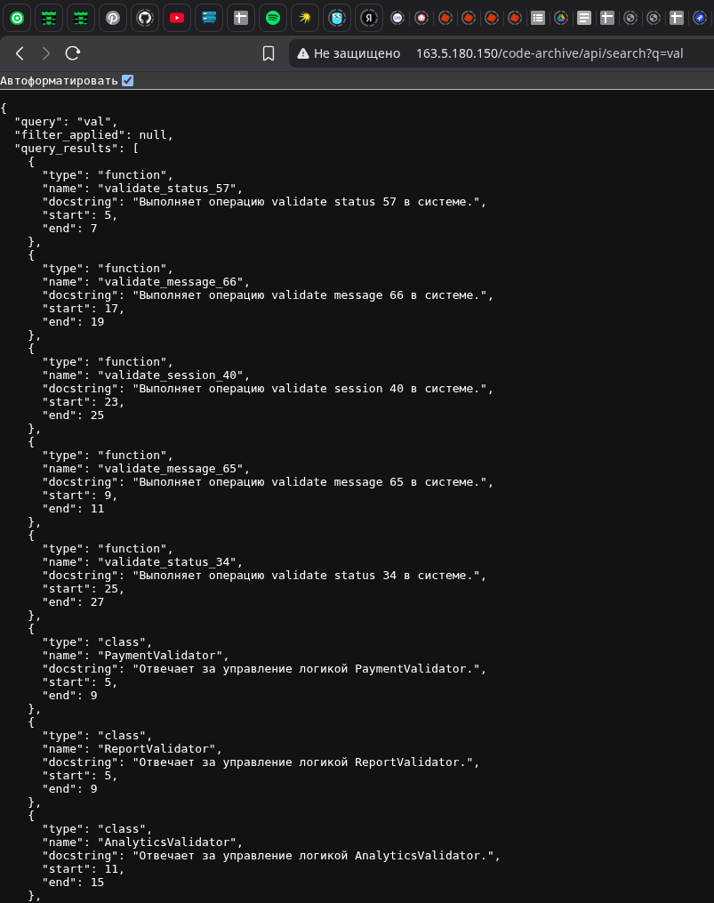
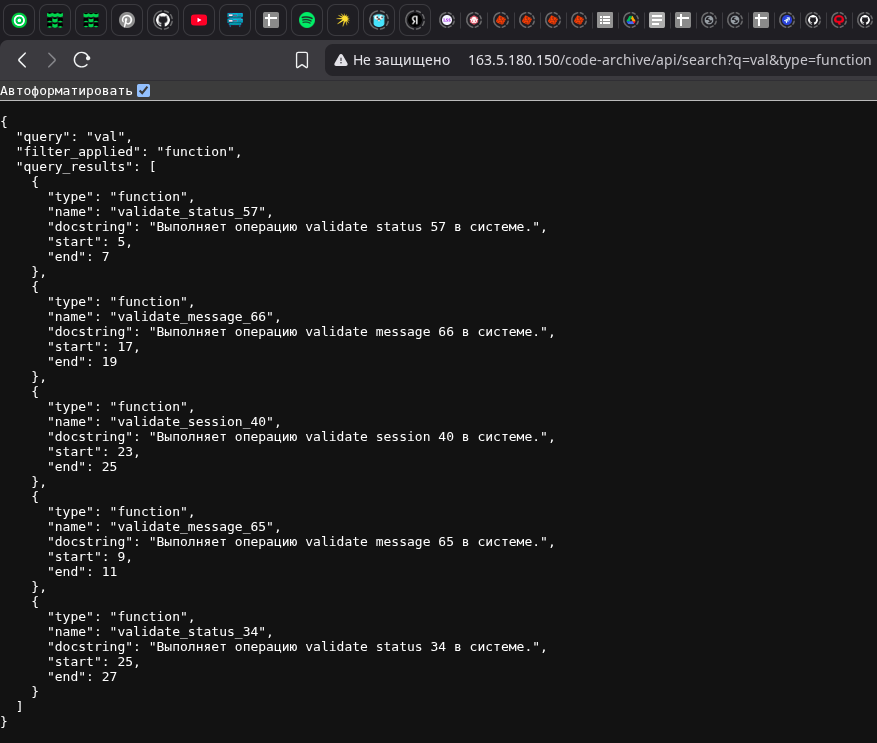
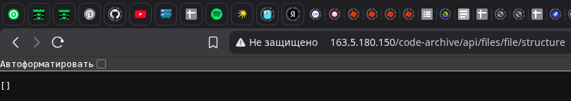

# Архиватор кода

Документация к программному интерфейсу (API) архива кода. В данном документе приведено описание архитектуры базы данных и основных эндпоинтов для взаимодействия с системой.
Также вы можете протестировать API, перейдя по ссылке http://163.5.180.150/code-archive/

---

## Схема базы данных

У таблицы `files` настроена связь «один ко многим», так как один файл может содержать в себе несколько функций и классов. Для обеспечения быстрого и эффективного поиска по кодовой базе поля `name` и `docstring` в связанных таблицах проиндексированы.

---

## Эндпоинты API

### Краткая статистика системы
Возвращает общую сводную информацию о количестве обработанных файлов, функций и классов в архиве.

* **Эндпоинт:** `/api/stats`

### Вывод списка всех файлов
Позволяет получить полный список файлов, находящихся в архиве, с указанием их уникальных идентификаторов и количества содержащихся в них функций.

* **Эндпоинт:** `/api/files`

### Полная информация о файле и его структуре
Возвращает подробную информацию о конкретном файле: его docstring, а также иерархический список всех функций и классов с указанием строк начала и конца их объявлений в коде.

* **Эндпоинт:** `/api/files/analytics_config.py/structure`

### Поиск по ключевому слову
Реализует полнотекстовый поиск по ключевому слову среди всех элементов архива. Поиск осуществляется по полям `name` и `docstring` как для функций, так и для классов.

* **Эндпоинт:** `/api/search?q=val`

### Поиск по ключевому слову с фильтрацией по типу
Позволяет искать совпадения по ключевому слову с применением дополнительного фильтра (например, ограничить выборку только функциями).

* **Эндпоинт:** `/api/search?q=val&type=function`

### Ошибка при поиске файла
Если запрашиваемый файл отсутствует в базе данных или путь указан неверно, система возвращает пустой результат.

* **Эндпоинт:** `/api/files/file/structure`

